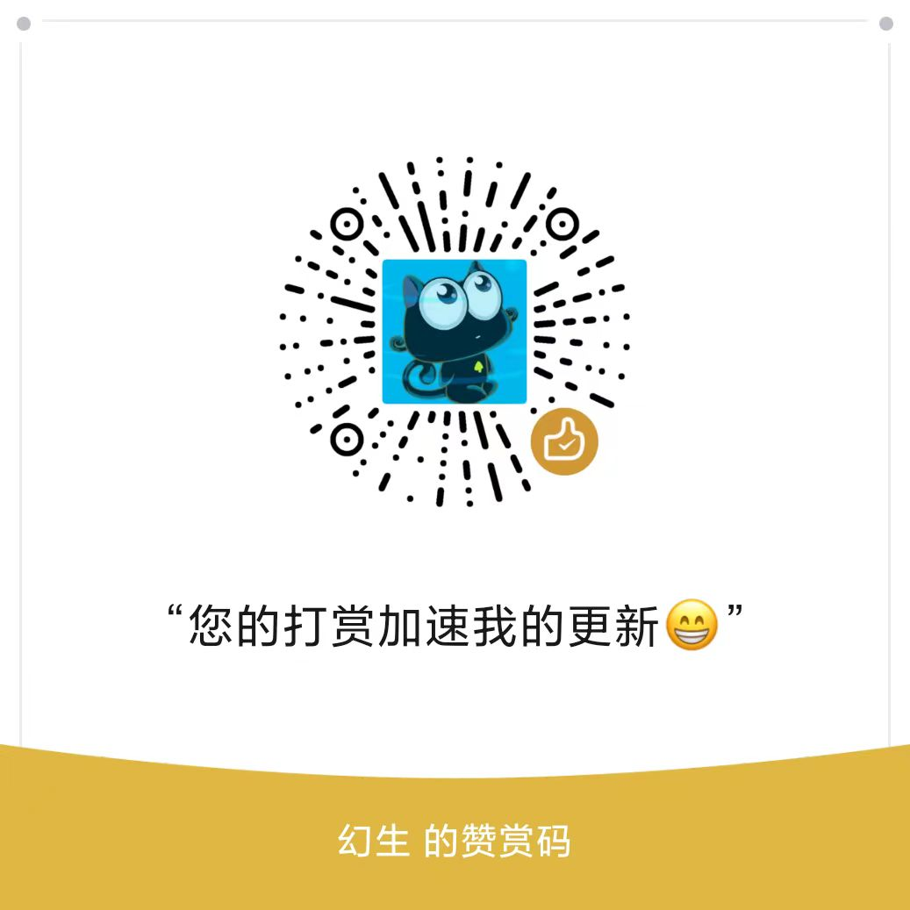

# 微信自动阅读助手

[](https://github.com/Huansheng1/my-qinglong-js)[](https://wechaty.js.org/docs/polyglot/typescript/)[](https://wechaty.js.org/docs/polyglot/python/)

> 项目地址：https://github.com/Huansheng1/wechat-auto-read-helper
> 本项目永远免费开源，严禁闲鱼倒卖，仅供学习交流，不得用于任何商业用途。
## 说明

⚠️【免责声明】
------------------------------------------

0. 本项目免费！免费！免费！仅供学习交流和测试，如果你在闲鱼买了，请去退款！！！！！

1. 此程序仅用于学习研究，不保证其合法性、准确性、有效性，请根据情况自行判断，本人对此不承担任何保证责任。
2. 由于此程序仅用于学习研究，您必须在下载后 24 小时内将所有内容从您的计算机或手机或任何存储设备中完全删除，若违反规定引起任何事件本人对此均不负责。
3. 请勿将此程序用于任何商业或非法目的，若违反规定请自行对此负责。
4. 此程序涉及应用与本人无关，本人对因此引起的任何隐私泄漏或其他后果不承担任何责任。
5. 本人对任何程序引发的问题概不负责，包括但不限于由程序错误引起的任何损失和损害。
6. 如果任何单位或个人认为此程序可能涉嫌侵犯其权利，应及时通知并提供身份证明，所有权证明，我们将在收到认证文件确认后删除此程序。

### 所有直接或间接使用、查看此程序的人均应该仔细阅读此声明。本人保留随时更改或补充此声明的权利。一旦您使用或复制了此程序，即视为您已接受此免责声明。

# 事前说明

> 仅供学习交流，出现封号等情况，与本仓库无关！

* 微信安全中心公告：https://mp.weixin.qq.com/s/9szvSZclomy5Pcq3Y-yH1A
  


## 使用说明

> 1. 微信版本必须是3.7.0.30，请先卸载自己电脑的微信，然后下载符合要求的微信版本，重新安装，记得前往设置，勾选不自动更新微信！
>
>    ​	老版本微信：[点击下载](https://github.com/tom-snow/wechat-windows-versions/releases/download/v3.7.0.30/WeChatSetup-3.7.0.30.exe)
>
> 2. 管理员权限 右键->以管理员身份运行 执行 安装程序.bat
>
>
> 3. 双击启动：微信自动过检测助手.exe
> 注意：启动成功后会在 文件传输助手 能找到个类似于 “当前过检测微信个人昵称：幻生，欢迎使用 幻生版免费过检测机器人” 的启动语
>
> 这样就是启动成功了，以后每天只需要先启动微信，然后再双击启动 exe就行了（青龙定时就设置在自己开电脑之后的时间即可）
>
> 
>
> 阅读台子：[猫眼看看阅读](https://github.com/Huansheng1/my-qinglong-js/blob/main/%E7%8C%AB%E7%8C%AB%E7%9C%8B%E7%9C%8B.py) 、[鱼儿阅读](https://github.com/Huansheng1/my-qinglong-js/blob/main/%E9%B1%BC%E5%84%BF%E9%98%85%E8%AF%BB.js) 、 [叮叮联盟阅读](https://github.com/Huansheng1/my-qinglong-js/blob/main/%E5%8F%AE%E5%8F%AE%E8%81%94%E7%9B%9F%E9%98%85%E8%AF%BB.js)
> 
>

## 环境要求

> 🚫 非开发用户不需要往下看。
> **开发用户**：根据文档提示，自行解决相关问题。

1. 必须存在`python`环境，请自行下载安装 py环境
2. 微信版本必须是`3.7.0.30`，请先卸载自己电脑的微信，然后下载符合要求的微信版本，重新安装，记得前往设置，勾选不自动更新微信！
> 提示：老版本微信可[点击这里](https://github.com/tom-snow/wechat-windows-versions/releases/download/v3.7.0.30/WeChatSetup-3.7.0.30.exe)下载

## 安装依赖
```bash
pip install -r requirements.txt -i https://pypi.douban.com/simple
```
## 步骤
1. 管理员权限 右键->`以管理员身份运行` 执行 `安装程序.bat`
2. 执行 `启动程序.bat` 就可以打开程序了
3. 如果报错，请自行解决或者记录issue（打赏催更更好不过了）

## 打包
> 注意：如果双击打不开编译后的exe文件，可以通过命令行的方式执行，这样不会闪退，可以看见日志哦！

> 使用 `--onefile` 选项将所有的依赖库打包成一个单独的可执行文件，而不是多个文件  
可以使用 `--name` 选项指定生成的可执行文件的名称  
可以使用 `--icon` 选项指定生成的可执行文件的图标文件  
`PyInstaller`可能无法自动识别脚本的所有依赖库，或者依赖库的路径不正确，使用 `--hidden-import` 选项手动添加缺失的依赖库  
如果脚本中使用了一些外部的资源文件（如图片、配置文件等），这些文件也需要被打包进可执行文件中。可以使用 `--add-data` 选项来指定资源文件的路径和在可执行文件中的相对路径  
```bash
pyinstaller --onefile --hidden-import comtypes --hidden-import requests --add-data "./DWeChatRobot.dll;." --add-data "./support-author.jpg;." --icon "./huansheng.ico" --name "微信自动过检测助手" -F start.py
```

## 赞赏
如果您觉得本项目对您有用，可以请我喝杯咖啡表示鼓励。


## 更新计划
1. - [x] 支持监听本地多个微信
2. - [x] 支持自动记录过检测文章对应的微信号，同一文章切换到不同的微信号阅读
3. 支持检测微信阅读是否已黑（暂时搁置）
4. 启用本地接口，与脚本通信，程序启动时方才阅读文章（暂时搁置）
6. 优化界面，升级微信版本号（暂时搁置）
7. etc...

## 特别鸣谢：
### 项目地址：[ComWeChatRobot](https://github.com/ljc545w/ComWeChatRobot/)

## 其他
* 学习交流群：[点我进入](https://t.me/huan_sheng)

## Star History[](https://star-history.com/#Huansheng1/my-qinglong-js&Date)

